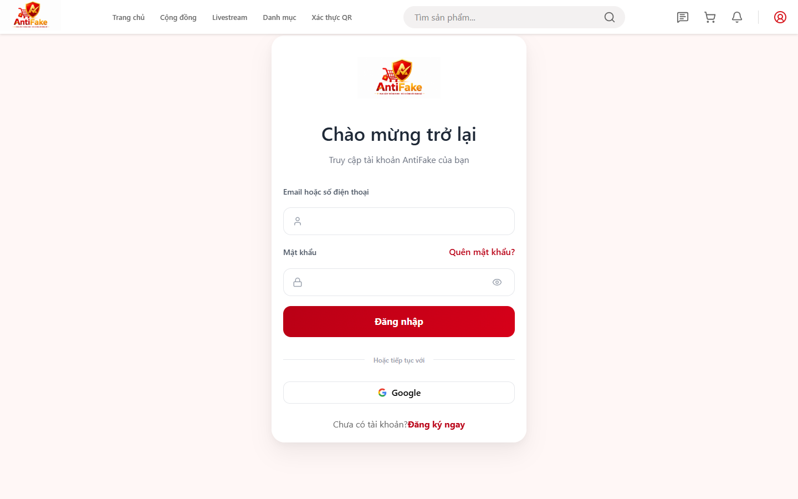
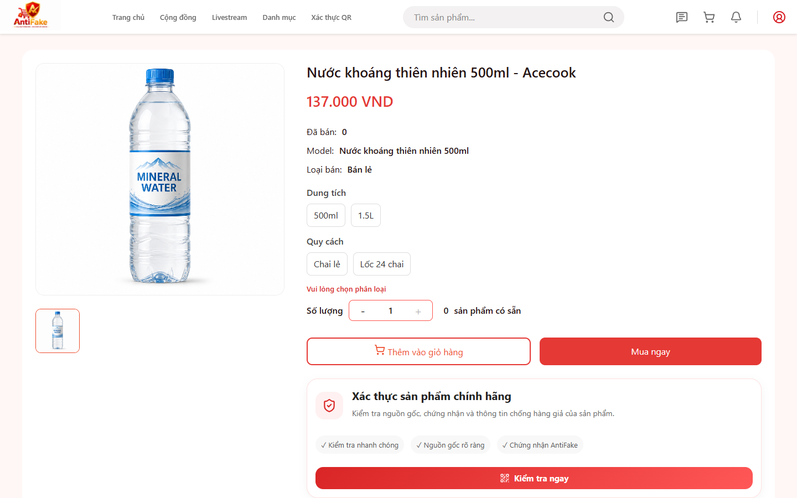
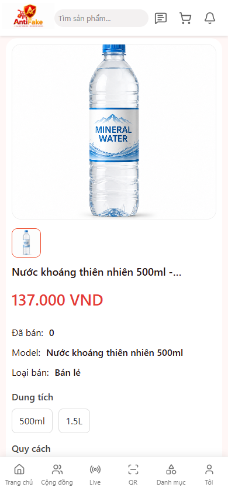
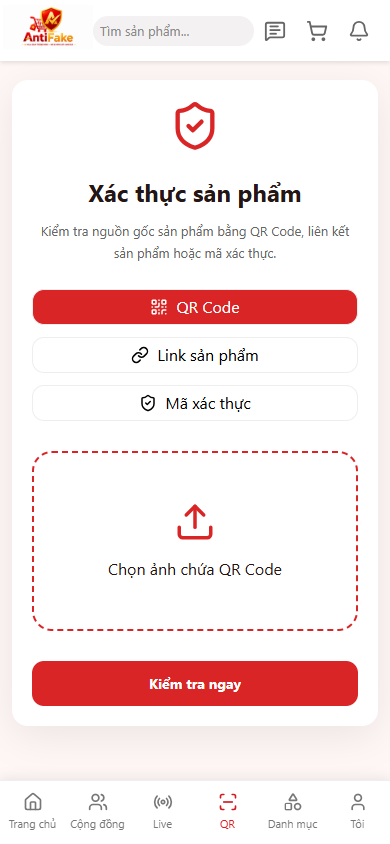
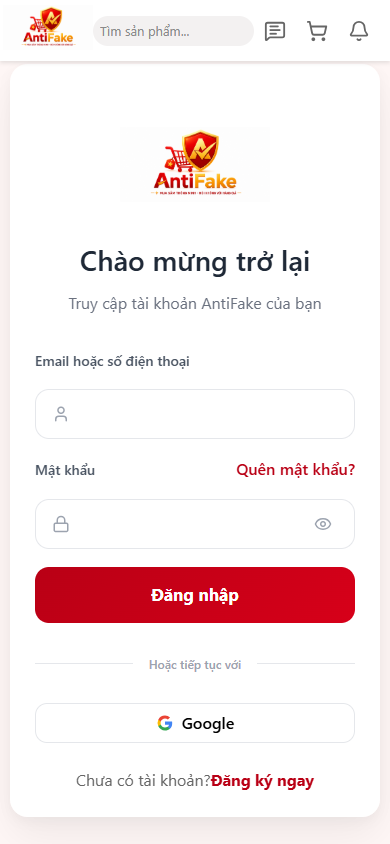
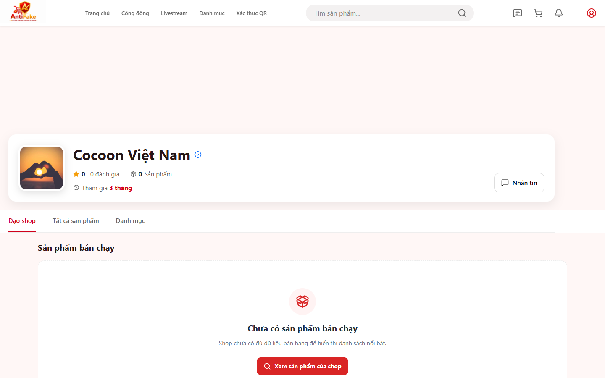
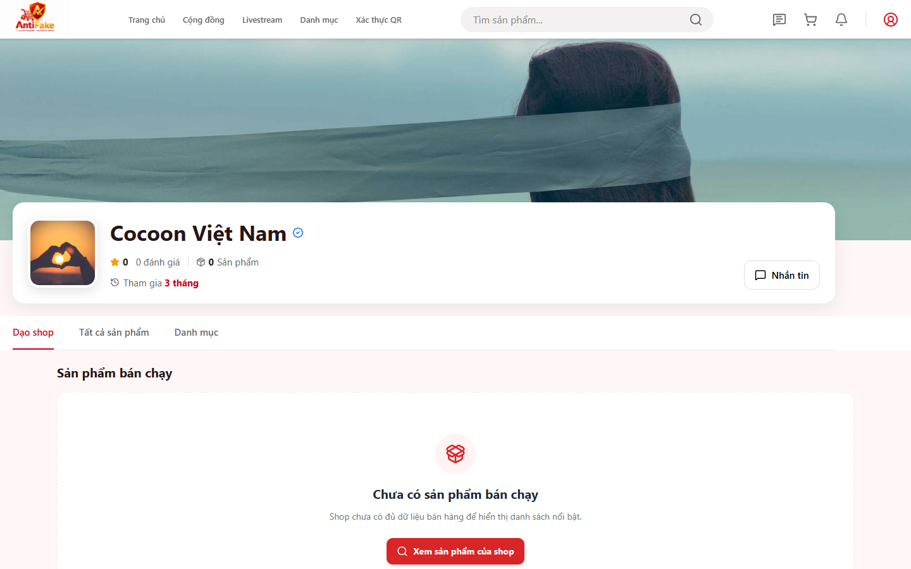

# Hướng dẫn sử dụng AntiFake — bản dự thảo UAT

> Tài liệu này chỉ mô tả các nhóm chức năng đã đối chiếu với source và các route
> public đã smoke test. Những flow có nhãn `Chưa xác minh` không được hiểu là đã
> hoạt động hoàn chỉnh.

> **Canonical-document note:** This is a retained UAT draft, not the canonical
> public/user-guide source. Use [`docs/user-guide/ANTIFAKE_USER_GUIDE.md`](user-guide/ANTIFAKE_USER_GUIDE.md)
> for the current role/journey guide, Help Center links and evidence-scoped
> statuses. The UAT artifacts remain authoritative for QA results.

## 1. AntiFake là gì?

AntiFake là nền tảng thương mại điện tử hỗ trợ kiểm tra nguồn gốc hàng hóa,
quản lý shop/sản phẩm, mua bán, affiliate, cộng đồng, chat và livestream. Địa
chỉ truy cập: <https://antifake.io.vn>.

## 2. Nhóm người dùng

| Role hoặc nhóm người dùng | Đối tượng | Điều kiện | Quyền chính |
|---|---|---|---|
| Khách | Người chưa đăng nhập | Không cần tài khoản | Xem các trang public, catalog/community/live/QR theo trạng thái public |
| Buyer | User role `user` | Đăng nhập và account active/đã xác minh theo flow | Hồ sơ, địa chỉ, cart, checkout, order, review, report, chat |
| Seller | User role `user` có shop | Có quan hệ sở hữu shop; shop phải đạt trạng thái phù hợp | Quản lý shop, offer, order, wallet, voucher, affiliate, live |
| Affiliate | User có `AffiliateAccount` | Account/program đúng trạng thái | Link/code, attribution, conversion, commission, payout |
| Admin | User role `admin` | Account active và session hợp lệ | Dashboard, user/KYC/shop/product review, moderation, wallet, voucher |

Seller và Affiliate không được tự hiểu là role database riêng; đây là quyền phát
sinh từ quan hệ user–shop hoặc user–affiliate account. Backend vẫn là ranh giới
phân quyền cuối cùng.

## 3. Các màn hình public đã xác nhận hiển thị

1. Mở trang chủ `/`.
2. Mở `/auth` để đăng nhập.
3. Mở `/register` để bắt đầu đăng ký.
4. Mở `/community` để xem khu vực cộng đồng.
5. Mở `/live` để xem phiên livestream public.
6. Mở `/qr` để bắt đầu xác thực QR.

Nếu trang yêu cầu đăng nhập, hãy đăng nhập bằng tài khoản được cấp trong môi
trường test. Không đưa mật khẩu, token, cookie hoặc dữ liệu CCCD vào tài liệu,
screenshot hay tin nhắn hỗ trợ.

### Trạng thái xác nhận production — tham chiếu canonical

Public routes, catalog, QR smoke, permission boundary, responsive layout và auth
negative path được ghi theo revision, project và skip gate trong
[`UAT_TEST_MATRIX.md`](UAT_TEST_MATRIX.md) và [`UAT_REPORT.md`](UAT_REPORT.md).
The latest targeted production checks cover the deployed Front-End `8157ffa`;
seller/admin mutations, payment, order transitions, withdrawal and provider
actions remain credential- or fixture-gated. This retained draft deliberately
does not repeat an unscoped aggregate count.

## 4. Flow chính — trạng thái xác minh

### Đăng nhập

**Role:** Buyer, Seller, Affiliate hoặc Admin có account active.

1. Mở `/auth`.
2. Nhập email/số điện thoại và mật khẩu được cấp.
3. Nhấn **Đăng nhập**.
4. Sau khi thành công, dùng menu phù hợp với role/quan hệ tài khoản.

**Lưu ý:** Account pending, suspended hoặc chưa xác minh có thể bị backend từ
chối. Không dùng workaround ở frontend để vượt qua trạng thái này. Google login,
email verification và reset password: **Chưa xác minh trong đợt hiện tại**.

### Mua hàng và thanh toán — chưa xác minh giao dịch sandbox

1. Mở sản phẩm public.
2. Chọn biến thể/số lượng rồi thêm vào giỏ.
3. Mở cart và chọn sản phẩm.
4. Chọn địa chỉ, phương thức vận chuyển, voucher hoặc mã affiliate nếu hợp lệ.
5. Kiểm tra tổng tiền do server tính.
6. Chỉ tiếp tục payment khi môi trường xác nhận sandbox/test mode.
7. Kiểm tra order sau reload.

Không thực hiện thanh toán tiền thật, không tạo hàng loạt order và không refresh
hoặc replay callback payment để thử nghiệm khi chưa có sandbox được xác nhận.

Nếu PayOS trả về trạng thái hủy/thất bại, hệ thống dùng `/payment-failed` và giữ
các trường callback cần thiết để đối soát. Đây là kiểm tra route an toàn; giao
dịch PayOS thật, webhook replay và việc cộng tiền wallet chưa được thực hiện.

### Xác thực QR — chưa xác minh production

1. Mở `/qr`.
2. Nhập hoặc quét mã test được cấp.
3. Đọc kết quả xác thực, risk và provenance được server trả về.

Không dùng mã thật, không sửa kết quả bằng client và không chia sẻ dữ liệu nội bộ.

## 5. FAQ tạm thời

- **Không vào được Admin:** cần role `admin`, account active và deployment mới đã
  được xác nhận; không chỉ dựa vào việc URL có mở được.
- **Không vào được Checkout:** cần đăng nhập và có dữ liệu cart/address phù hợp;
  guest sẽ được chuyển về trang đăng nhập.
- **Không đăng nhập được:** kiểm tra trạng thái account và xác minh email/phone;
  liên hệ người quản trị môi trường test.
- **Google/email/phone lỗi:** các provider flow đang chờ xác minh runtime trong
  môi trường có cấu hình tương ứng.
- **Thanh toán lỗi:** không retry trên payment production; ghi lại order/payment
  state và dùng sandbox theo runbook.
- **QR không hợp lệ:** kiểm tra mã test, định dạng và trạng thái scan; không tự
  sửa response.
- **Chat/livestream không realtime:** kiểm tra quyền session, WebSocket/Agora
  configuration và reconnect; flow này chưa được sign-off production.

## 6. Tài liệu và hình ảnh

Ảnh minh họa UAT được lưu dưới `docs/images/` sau khi deployment được xác nhận;
đây không phải là tuyên bố sign-off cho các flow. Ảnh hướng dẫn hiện hành và
trạng thái raw/annotated được quản lý trong
[`user-guide/VISUAL_MANIFEST.md`](user-guide/VISUAL_MANIFEST.md). Không dùng
ảnh baseline của admin guest exposure làm ảnh hướng dẫn người dùng.

## 7. Evidence sau deployment

Các ảnh dưới đây chỉ minh họa kết quả UAT, không phải dữ liệu đăng nhập:

Ảnh shop trước/sau cải thiện banner:

Admin seed login vẫn bị chặn do trạng thái account `suspended`; cần cấp một
account admin test `active` riêng nếu muốn tiếp tục walkthrough quản trị.
