# AntiFake User Guide

> Canonical master guide for the Help Center, Journey Center and
> [evidence-scoped ebook draft](ANTIFAKE_USER_GUIDE_EBOOK.md).
> Status: **IN_PROGRESS**. This guide consumes the evidence recorded in the UAT
> artifacts; it does not replace them or sign off production flows.

## Contents

- [How to use this guide](#how-to-use-this-guide)
- [Ebook draft](ANTIFAKE_USER_GUIDE_EBOOK.md)
- [Start with AntiFake](#start-with-antifake)
- [Quick Guide](#quick-guide)
- [Buyer journeys](#buyer-journeys)
- [Seller journeys](#seller-journeys)
- [Admin journeys](#admin-journeys)
- [QR verification](#qr-verification)
- [Help Center and Journey Center](#help-center-and-journey-center)
- [Troubleshooting](#troubleshooting)
- [FAQ](#faq)
- [Glossary](#glossary)

## How to use this guide

Choose a role, then choose a goal and follow the linked steps. The web Help
Center is available at `/help`; each supported article also has a stable deep
link. Journey Center chooses a Desktop or Mobile presentation from the current
viewport and lets the reader override that choice.

The guide distinguishes three kinds of evidence:

- **Verified in current UAT scope:** source and the stated runtime scope agree.
- **Partially verified:** a read-only or public portion works, but one or more
  important steps remain open.
- **Not yet verified:** source or UI exists, but runtime evidence is not enough
  to publish a complete production procedure.

Do not use a guide article to bypass authentication, authorization, payment,
KYC, wallet, upload, or other safety controls. Backend permissions remain the
source of truth.

## Start with AntiFake

AntiFake provides public product discovery, Shop and product management,
commerce flows, provenance/QR surfaces, community, chat, livestream and
administration features. Available functionality depends on account state,
Shop ownership, approval state, provider configuration and the current
deployment.

Public routes currently covered by production smoke include home, authentication,
registration, community, livestream discovery and the QR page on Desktop,
Laptop and Mobile. Public route reachability does not prove every action on a
page is complete.

## Quick Guide

These shortcuts point to the canonical Journey Center articles. They are
navigation aids, not additional production claims; each link retains the
runtime status shown in the Documentation Registry and UAT matrix.

### Buyer

- [Check a product by QR — B03](/help/qr/verify-product) — `PARTIAL`.
- [Buy a first product — B04](/help/buyer/first-purchase) — `PARTIAL`.
- [Track an order — B05](/help/buyer/orders) — `PARTIAL`.
- [Use a voucher — B06](/help/buyer/voucher) — `SOURCE_VERIFIED`.

### Seller

- [Register a Shop — S01](/help/seller/register-shop) — `SOURCE_VERIFIED`.
- [Set up a Shop — S02](/help/seller/shop-setup) — `PARTIAL`.
- [Create a first product — S03](/help/seller/create-product) — `PARTIAL`.
- [Process a first order — S05](/help/seller/process-order) — `PARTIAL`.
- [Create a Shop voucher — S06](/help/seller/voucher) — `PARTIAL`.

Authenticated actions still require the approved role, fixture and runtime
evidence described by each status.

## Buyer journeys

### Create an account and begin using AntiFake

Open [Tạo tài khoản và bắt đầu sử dụng](/help/buyer/account-start) for the
source-backed B01 map. The public `/auth` login and buyer-registration entry
surfaces have matching Desktop/Mobile raw and annotated captures in the
[Visual Manifest](VISUAL_MANIFEST.md), captured after Front-End `6b24be3` with
clean browser diagnostics. Use the current authentication flow, then check the
profile and address screens after a successful session; those authenticated
read-only surfaces passed production, while mutations and final feature visuals
remain open. The full positive registration journey remains `PARTIAL` until its
runtime evidence is complete. The public `/register` route is the seller
Shop-registration
boundary and redirects a guest to `/auth`; it is not the buyer registration
mode shown in these B01 captures.

#### B01 public entry visuals

The following annotated captures illustrate the verified public registration
entry only; they do not prove successful account creation or profile setup.

**Desktop**

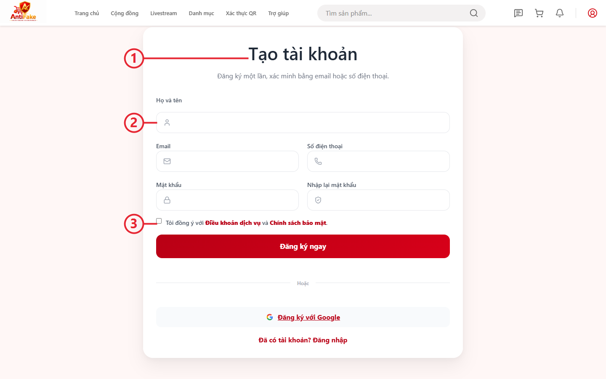

**Mobile**

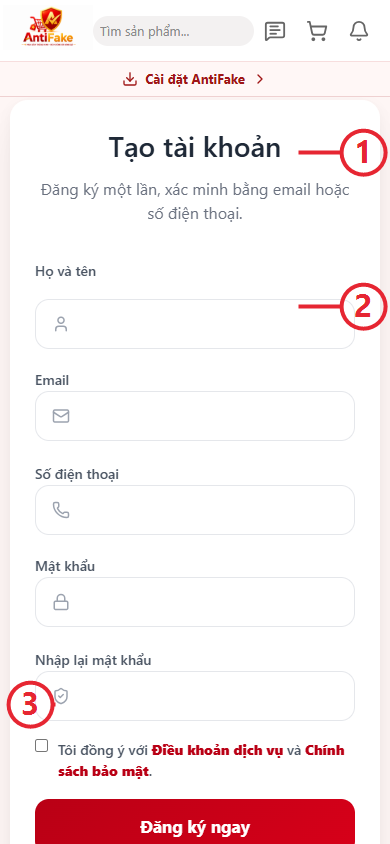

### Find and explore products

Use [Tìm kiếm và khám phá sản phẩm](/help/buyer/discover) for B02. Search,
catalog, Shop and product detail surfaces are available in the inspected source
and public smoke scope. Check the current server response for variant and stock
before adding anything to a cart.

The public home, category, filtered-results, search, Shop-detail and
product-detail steps have matching Desktop and Mobile raw/annotated evidence
in the [Visual Manifest](VISUAL_MANIFEST.md), captured after Front-End
`6b24be3`. This verifies the public read-only discovery subset. Sorting,
reviews, provenance actions and authenticated purchase steps remain open, so
the complete B02 journey remains `PARTIAL`.

#### B02 public discovery visuals

These annotated captures cover the verified public catalog and product-detail
steps. Sorting, reviews, provenance actions and authenticated purchase steps
remain outside the captured scope.

**Desktop**

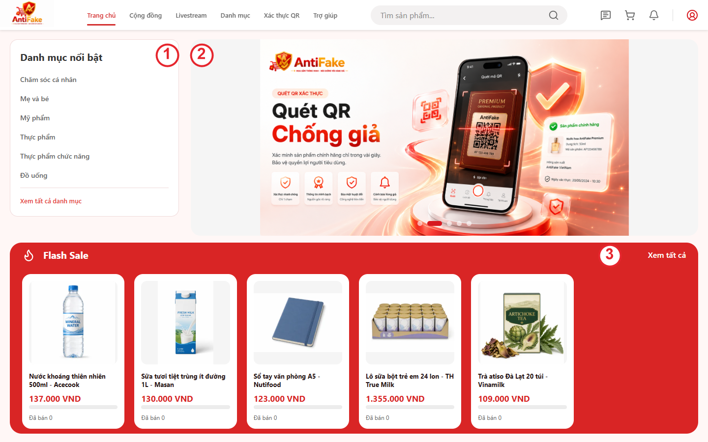

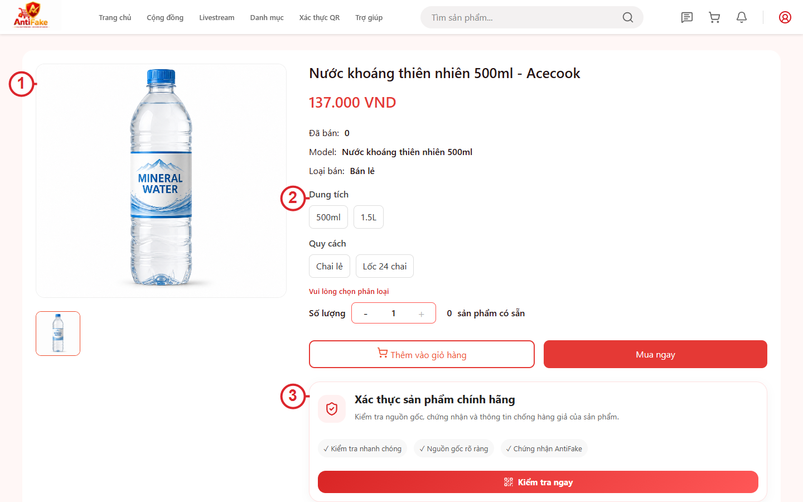

**Mobile**

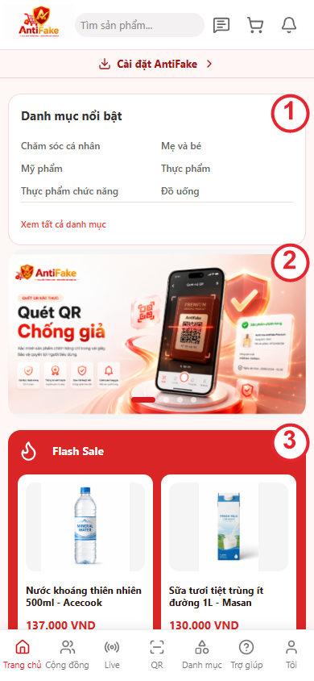

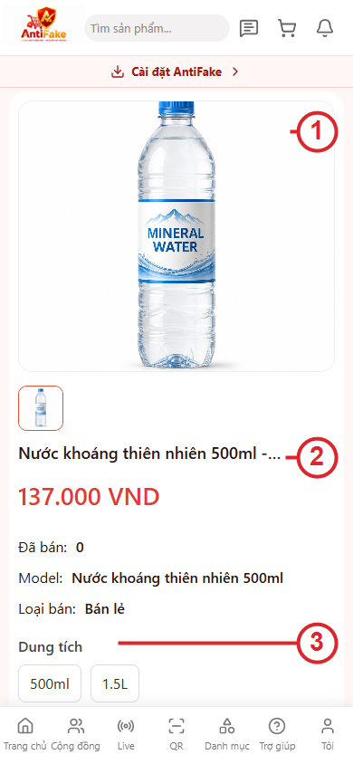

### Buy your first product

Open [Mua sản phẩm đầu tiên](/help/buyer/first-purchase) for the step-by-step
journey:

1. Find a public product.
2. Review product detail, shop, stock and variant information.
3. Add a valid variant and quantity to the cart.
4. Review selected cart items.
5. Choose an address and shipping option.
6. Continue only when the server quote provides the payable total.
7. Track the resulting order after a successful order creation.

The public catalog and read-only checkout surfaces have evidence. The
production Buy Now path now has a Desktop/Laptop/Mobile read-only quote pass:
GHN shipping loaded and the server returned the payable total. The historical
cart quote issue and order mutation remain open; do not describe a fallback
total as an approved payable amount. A separate reversible cart-badge check
used the seeded demo Buyer cart: one line changed `2 -> 3 -> 2` and the header
badge changed `7 -> 8 -> 7`, with the original cart state restored. This
verifies cart quantity feedback only; payment and order creation remain open.

For the cart quantity step, use the matching Desktop and Mobile annotated
visuals: [Desktop cart](../images/buyer/cart-desktop-production-8157ffa-annotated.png)
and [Mobile cart](../images/buyer/cart-mobile-production-8157ffa-annotated.png).
They point out the header quantity badge and the quantity control; they do not
represent a completed quote, order or payment.

#### B04 cart badge visuals

| Platform | Annotated visual |
|---|---|
| Desktop 1440x900 | 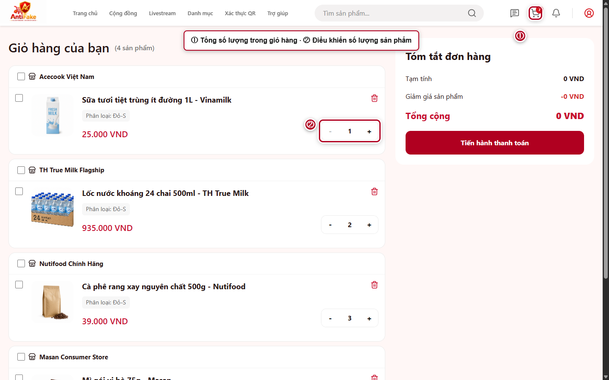 |
| Mobile 390x844 | 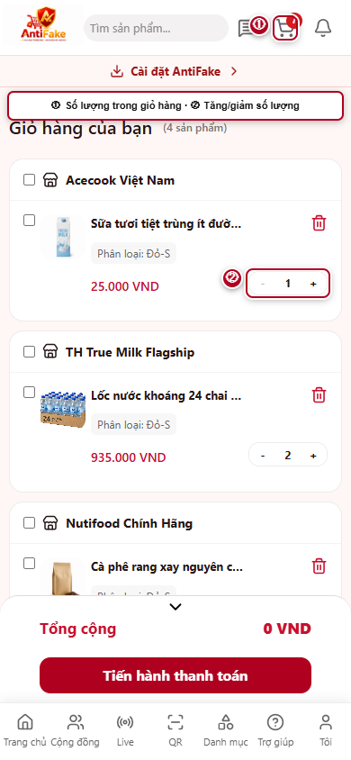 |

These visuals cover the reversible quantity/badge check only. B04 remains
`PARTIAL` until the quote, order and payment portions have matching evidence.

### Track an order

Use [Theo dõi đơn hàng](/help/buyer/orders). Open only orders owned by the
current account and follow the action offered for the current server-owned
status. Receive, review, refund, cancellation and dispute behavior remain
separate evidence items until their runtime paths are tested.

### Chat, voucher and livestream

Use the current source-backed journeys for [voucher](/help/buyer/voucher),
[Chat with Shop](/help/buyer/chat-shop) and [livestream](/help/buyer/livestream).
The current evidence boundaries are specific:

- Chat entry points are available, but two-session send/receive, history,
  reconnect, presence and typing still require a PII-safe buyer/seller thread
  and a working realtime connection. No production message mutation is claimed.
- Voucher read-only views are available, but eligibility, application, create,
  activation and deactivation still require an active matching voucher and an
  isolated order fixture. The server-calculated total remains authoritative.
- Livestream discovery is available, but joining or hosting, media,
  comments/reactions, reminders and leaving require an eligible live session
  and Agora sandbox configuration. No provider action is claimed in production.

These boundaries keep B06, B07 and B09 evidence-scoped; none is promoted to
`VERIFIED` by the guide text.

### Community

Use [Community](/help/buyer/community) for B08. Read the feed and use only
interactions that the current UI and account permission expose. Authenticated
interaction, reporting and moderation behavior remain `PARTIAL`.

### Livestream

Use [Livestream](/help/buyer/livestream) for B09. The public `/live`
discovery surface has matching Desktop and Mobile raw/annotated evidence in the
[Visual Manifest](VISUAL_MANIFEST.md), captured after Front-End `6b24be3`.
Provider setup, joining, interaction and leaving a live remain `PARTIAL` until
an eligible live-session fixture plus Agora App ID/certificate/token sandbox
configuration are verified.

#### B09 discovery visuals

The public livestream discovery shell has matching annotated captures. These
do not document provider setup, joining, interaction or leaving.

**Desktop**

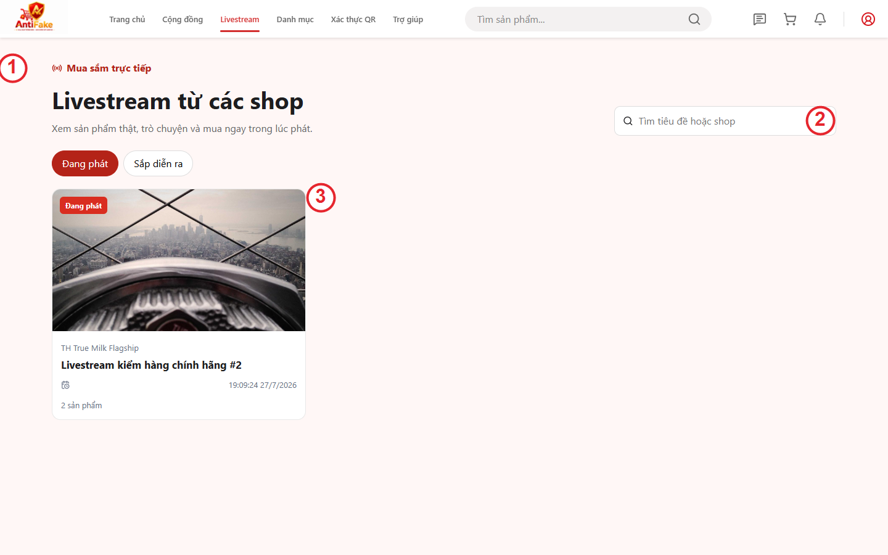

**Mobile**

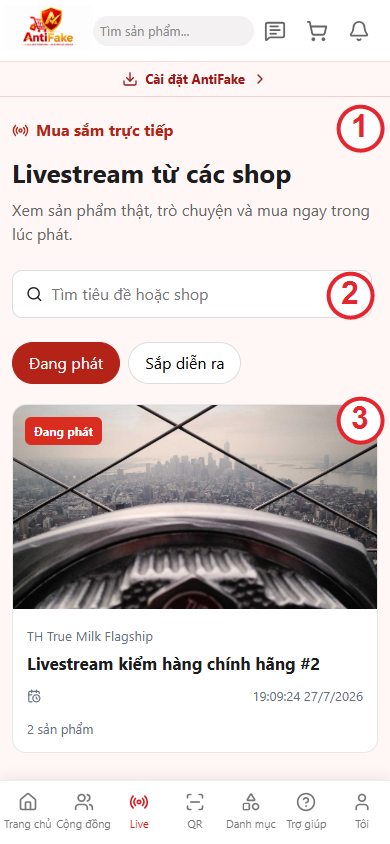

## Seller journeys

### Seller Getting Started

On Seller Dashboard, use the **Bắt đầu bán hàng** checklist as the next-action
map:

1. Hoàn thiện Shop.
2. Xác minh/KYC nếu cần.
3. Tạo và gửi duyệt sản phẩm đầu tiên.
4. Đăng sản phẩm sau khi được duyệt.
5. Tạo voucher.
6. Nhận và xử lý đơn đầu tiên.

The checklist reads Shop, product, voucher and order states from the backend.
It must not be treated as complete when those requests fail, and it does not
replace the approval or order-transition rules shown by the application.

### Register a Shop

Start with [Đăng ký trở thành Shop](/help/seller/register-shop). Prepare the
information shown by the registration form, submit it for review and wait for
the actual approval state. Do not assume that a user account is a seller role;
seller access is derived from the user-Shop relationship and backend checks.

### Set up the Shop

Follow [Thiết lập Shop](/help/seller/shop-setup) for S02. Update only the
profile and business fields shown for the current Shop, then reload or read the
server response to confirm the saved state.

### Publish the first product

Follow [Đăng sản phẩm đầu tiên](/help/seller/create-product): enter basic
information, add sanitized media, configure variant/SKU/price/inventory, then
submit for review. The source path is documented, but authenticated mutation,
moderation and production publication remain unverified in the current UAT
scope.

### Manage products

Use [Quản lý sản phẩm](/help/seller/manage-products) for S04. Product status,
moderation status, variants and inventory must be read from the current server
state; a visible edit form is not proof that a change was saved or published.

### Process the first order

Follow [Xử lý đơn hàng đầu tiên](/help/seller/process-order). At every step,
act only on an order belonging to the Shop and only use the transition offered
for its current state. Wallet, commission and settlement changes must be read
from their backend records; this guide does not infer money movement.

Continue with [Shop wallet](/help/seller/wallet), [Shop vouchers](/help/seller/voucher),
[Affiliate](/help/seller/affiliate) and [seller livestream](/help/seller/livestream).
These articles remain evidence-dependent; see the matrix for the current
status and required next evidence.

#### S07 Affiliate program visuals

The read-only Affiliate program view has matching production captures. They
show program discovery, the available terms and the referral-code/join area;
joining, attribution, conversion and payout remain unverified.

**Desktop 1440×900**

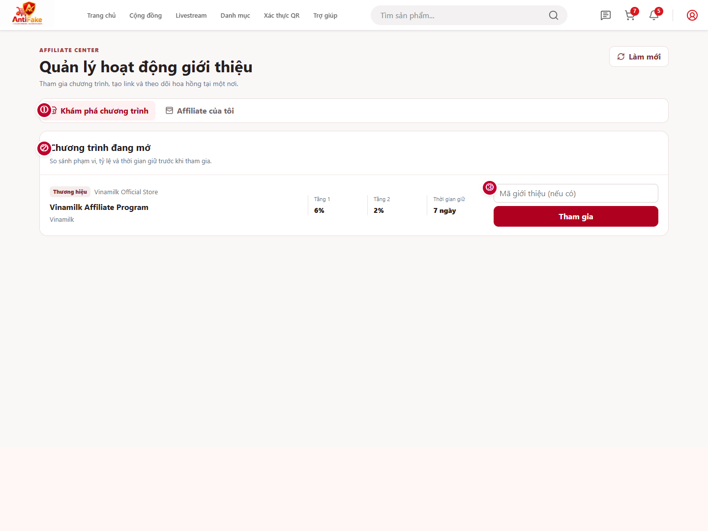

**Mobile 390×844**

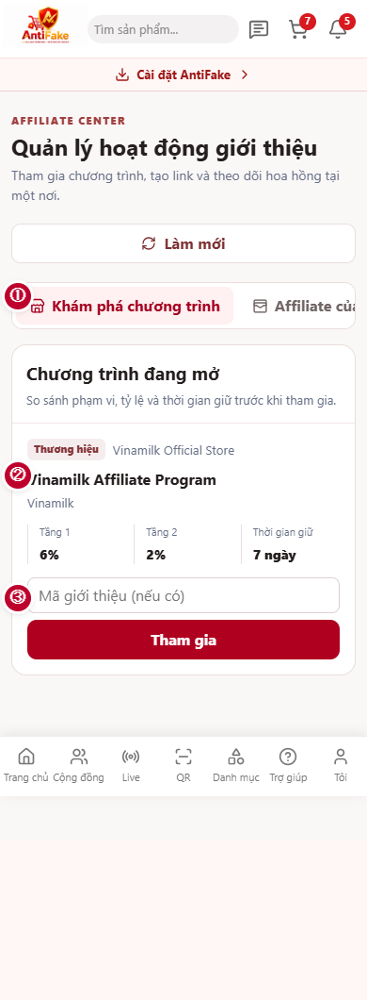

## Admin journeys

The Admin guide is intentionally separate from general user guidance. Open
[Duyệt Shop và sản phẩm](/help/admin/admin-review) only with an approved,
active Admin test identity. The source seed snapshot marks its Admin record as
suspended, but the approved production Admin identity used for this evidence
was active. The read-only route inventory is production-verified only for the
covered screens; it is not a full Admin walkthrough.

Admin capabilities in source include dashboard, user management, KYC,
Shop/product review, moderation, orders/payment oversight, voucher, wallet and
audit surfaces. The [Admin journey index](/help/admin/admin-dashboard) maps
A01-A10; A01, A02, A04, A05, A08 and A09 are `PARTIAL` after the production
read-only route inventory, while A03, A06, A07 and A10 are
`NOT_IMPLEMENTED` in the current frontend route map.
A source route or component is not proof that the corresponding permission or
mutation is ready for production use.

#### A01 Admin dashboard visual guide

These annotated captures document the verified read-only dashboard shell after
Front-End `bb0eee1`. They do not prove the untested KYC, moderation,
order/payment, withdrawal or other Admin mutations.

**Desktop 1440×900**

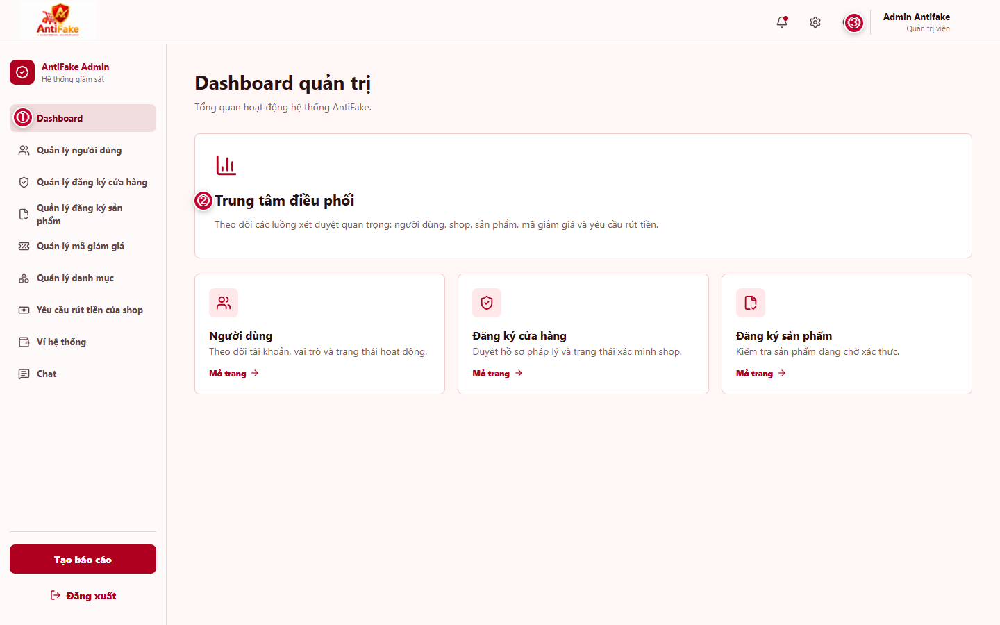

**Mobile 390×844**

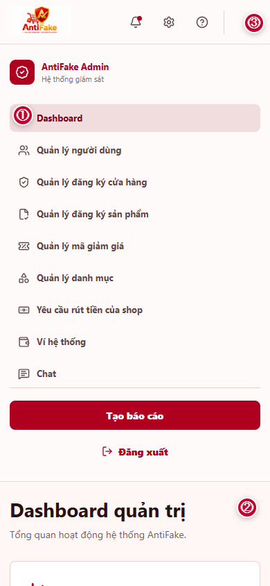

Markers: ① active Dashboard navigation, ② main coordination area, ③ header
controls and identity area. The original captures and annotation metadata are
registered in [the Visual Manifest](VISUAL_MANIFEST.md).

#### A05 and A09 Admin visual guides

The following production captures extend the read-only Admin evidence on Front-End
`9637e9f`. A05 shows the product-registration moderation queue and A09 shows the
platform-voucher workspace. Each pair has a raw UAT capture and a separate
annotated documentation copy at Desktop 1440x900 and Mobile 390x844. These
visuals do not verify moderation decisions, voucher mutations or other writes.

- A05 product review: [Desktop annotated](../images/admin/admin-product-registrations-desktop-production-9637e9f-annotated.png), [Mobile annotated](../images/admin/admin-product-registrations-mobile-production-9637e9f-annotated.png)
- A09 platform promotions: [Desktop annotated](../images/admin/admin-vouchers-desktop-production-9637e9f-annotated.png), [Mobile annotated](../images/admin/admin-vouchers-mobile-production-9637e9f-annotated.png)

| Journey | Desktop | Mobile |
|---|---|---|
| A05 Product review | 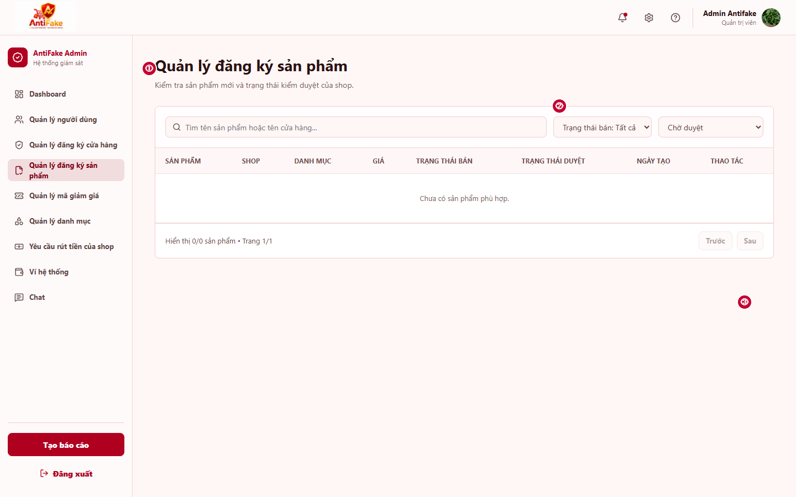 | 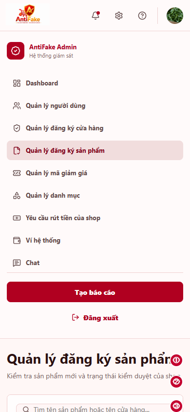 |
| A09 Platform promotions | 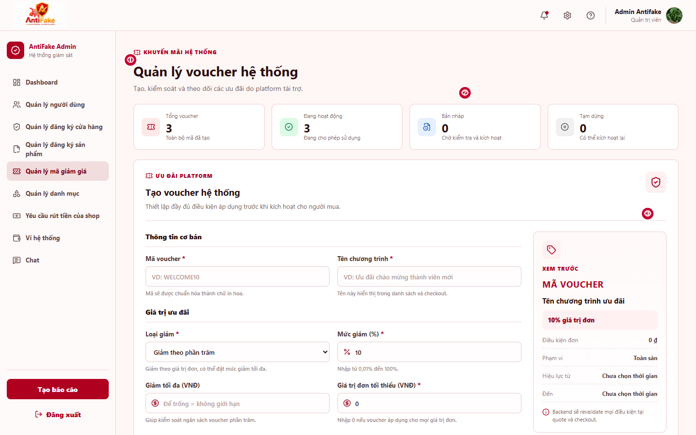 | 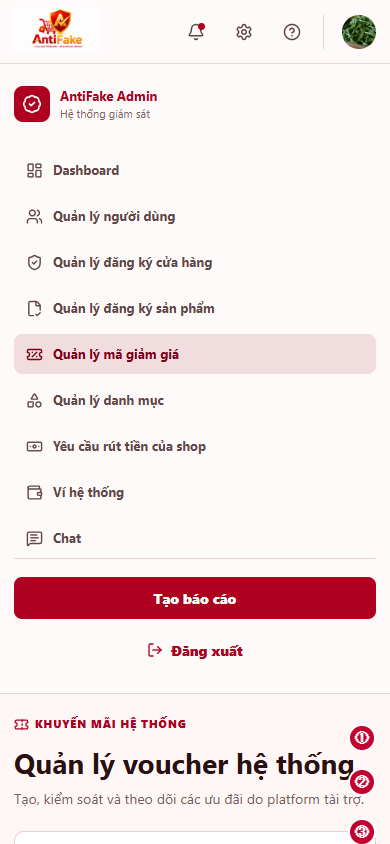 |

Markers identify the Admin navigation, page/filter context and visible list or
form state. Raw and annotated files are registered separately in the
[Visual Manifest](VISUAL_MANIFEST.md).

## QR verification

Open [Kiểm tra sản phẩm bằng QR](/help/qr/verify-product) to see the current
public surface. The local code and link tabs send input to the server-owned
verification endpoint and render verified, suspicious, inactive or not-found
states. The deployed public code/link path has been retested with an isolated
unknown value and returned the server-owned `NOT_FOUND` state with a successful
GET on Desktop, Laptop and Mobile. The image picker now accepts PNG, JPEG and
WebP files up to 5 MB, decodes them in the browser and sends only the decoded
value to the same verification endpoint. A deterministic unknown image fixture
also returned `NOT_FOUND` in production on all three viewports with no browser
errors. A known positive fixture and final visual evidence remain pending, so
this journey remains `PARTIAL`.

## Help Center and Journey Center

- **Help Center:** search by title, feature, role or journey and open an article.
- **Journey Center:** open a goal, read one step at a time, move backward or
  forward, return to the overview and switch Desktop/Mobile.
- **Registered visuals:** accepted evidence-backed steps show the matching
  annotated Desktop or Mobile visual; steps without matching evidence keep an
  explicit visual-pending placeholder.
- **Unavailable journeys:** entries marked `NOT_IMPLEMENTED` show the status
  and evidence boundary but do not expose actionable step instructions.
- **Contextual help:** implemented links deep-link to the relevant article or
  step; future links follow the same rule and never send the user to a generic
  landing page.
- **Visual guide:** screenshots are added only after the matching deployment,
  viewport, role and test data are verified. Original and annotated assets are
  kept separately.

## Tools and account settings

These supporting areas sit outside the main Buyer/Seller/Admin journey IDs but
are part of the product surface:

| Area | Route | Evidence boundary |
|---|---|---|
| Profile | `/profile` | The route is protected; read and update behavior needs an approved User session. |
| Address book | `/profile/address` | Address ownership and default selection must be confirmed after reload. |
| Notifications | `/notification` | The route is protected; unread data and FCM behavior remain runtime-scoped. |
| Favorites | `/wishlist` | The route is protected; add/remove persistence remains authenticated UAT scope. |
| Wallet | `/profile/wallet`, `/seller/wallet` | Balances and mutations must come from backend state; no money movement is inferred. |
| Affiliate | `/affiliate`, `/seller/affiliate` | Affiliate is a user relationship/account, not assumed to be a separate User role. |
| Install and security settings | `/install`, `/profile/settings` | Use the current redirect and browser permission behavior; do not bypass auth or device controls. |

The table is a navigation map, not a production sign-off. Supporting features
inherit the same source/runtime/evidence status rules as the main journeys.

## Troubleshooting

| What you see | What to do |
|---|---|
| A private page redirects to authentication | Sign in with an approved active test identity; do not bypass the guard. |
| Checkout has no payable total | Stop before placing the order and record the quote error. A fallback display is not sign-off. |
| QR image cannot be read or returns no result | Try a clearer PNG, JPEG or WebP image under 5 MB, or use the link/code tabs; do not invent a result or edit the response in the browser. |
| Shop or Admin action is unavailable | Check account, Shop and approval state; backend authorization is authoritative. |
| A guide screenshot looks different | Check its manifest revision and viewport before reusing it; mark it stale if the UI changed. |

## FAQ

### Does a visible route mean the feature is ready?

No. The route must be compared with backend behavior, database/state rules,
permissions and runtime evidence.

### Can I use a desktop screenshot as a mobile guide?

No. Mobile guidance uses a real Mobile viewport capture. A resized Desktop image
is not a Mobile visual.

### Does documentation completion sign off UAT?

No. `UAT_STATUS` and `DOCUMENTATION_STATUS` remain separate. Open and blocked
UAT rows remain open even when an article exists.

## Glossary

- **Journey:** a user goal composed of ordered, navigable steps.
- **Evidence:** source, test, runtime observation or screenshot tied to a
  specific revision and scope.
- **Source verified:** the implementation exists in inspected source, but the
  runtime evidence is incomplete.
- **Partial:** only part of the journey has been validated.
- **Visual Manifest:** the registry connecting a journey step to original and
  annotated screenshots, viewport and application revision.
